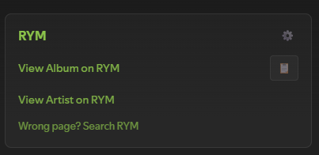
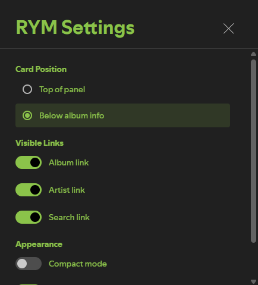
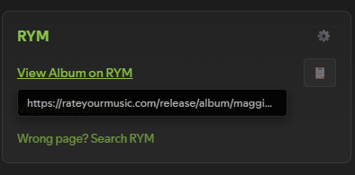
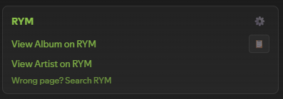

# RateYourMusic Spicetify Extension

<!-- site:skip-start -->
**Documentation:** https://spicetify.yusufaf.dev/rym/
<!-- site:skip-end -->

Quick access to RateYourMusic album pages directly from Spotify.



## Features

- **Direct Album Links**: One-click access to RYM album pages
- **Artist Links**: Quick access to artist pages on RYM
- **Smart Release Type Detection**: Automatically detects albums, EPs, singles, mixtapes, and compilations
- **Fallback Search**: Quick search option if the direct link doesn't work
- **URL Tooltips**: Hover over links to preview the full URL before clicking
- **Configurable Settings**: Customize position, visible links, appearance, and more
- **Copy to Clipboard**: One-click copy button for album URLs
- **Native Integration**: Blends seamlessly with Spotify's right sidebar UI
- **Theme-Agnostic**: Works with any Spicetify theme
- **Lightweight**: Minimal code, no external dependencies

## How It Works

The extension intelligently determines the RYM release type using:

1. **Album name pattern detection** (e.g., "mixtape", "EP", "compilation" in title)
2. **Spotify metadata analysis** (`album_type` + track count)
3. **Smart heuristics** (e.g., 4-6 tracks → likely EP)

This generates accurate RYM URLs like:
- `/release/album/artist/album-name/` for full albums
- `/release/ep/artist/ep-name/` for EPs
- `/release/mixtape/artist/mixtape-name/` for mixtapes
- `/release/comp/artist/compilation-name/` for compilations
- `/release/single/artist/single-name/` for singles

If the direct link doesn't match (edge cases happen), use the fallback "Search RYM" link.

## Installation

### Prerequisites

[Spicetify](https://spicetify.app/) must be installed and working.

### Steps

1. Clone or download this repository:
   ```bash
   git clone https://github.com/yusufaf/spicetify-rym.git
   ```

2. Copy the extension file to your Spicetify extensions folder:

   **Windows:**
   ```bash
   copy spicetify-rym\rym-integration.js "%APPDATA%\spicetify\Extensions\rym-integration.js"
   ```

   **macOS/Linux:**
   ```bash
   cp spicetify-rym/rym-integration.js ~/.config/spicetify/Extensions/rym-integration.js
   ```

3. Enable the extension:
   ```bash
   spicetify config extensions rym-integration.js
   spicetify apply
   ```

4. Reload Spotify - the RYM section will appear in the right sidebar

## Usage

Once installed, the extension automatically displays RYM links in the right sidebar (where "About the artist", "Credits", etc. appear).

**Links provided:**
- **"View Album on RYM"** - Direct link to album page
- **"View Artist on RYM"** - Direct link to artist page
- **"Wrong page? Search RYM"** - Fallback search option

All links open in new tabs. Hover over any link to preview the URL.

## Settings

Click the gear icon (⚙️) in the RYM card header to open settings.

**Card Position:**
- Top of panel
- Below album info (default)

**Visible Links:**
- Album link (on/off)
- Artist link (on/off)
- Search link (on/off)

**Appearance:**
- Compact mode - Reduces padding and font sizes
- Show URL tooltips - Preview URLs on hover

**Companion API (optional, blank by default):**
- API base URL / API token - see below
- Show my captured rating and genres

## Companion API (optional)

By default this extension makes **no network requests of any kind**. It builds RYM URLs from the album metadata Spotify already gave it and renders links. Nothing leaves your machine. If that is what you want, skip this section — the fields are blank out of the box and there is nothing to turn off.

Filling them in connects the extension to a companion API that you host yourself on AWS, which adds two things:

**Links that actually resolve.** RYM disambiguates releases with suffixes — Björk's *Homogenic* lives at `/homogenic-17/`, Jay-Z's *The Blueprint* at `/the-blueprint.p/`. Nothing in Spotify's metadata can tell you that suffix exists, so no amount of slug logic will ever produce it. The only way to know a URL is right is for somebody to have landed on it. Once a page has been captured, the card links straight to it and shows a `✓`.

**Your own RYM data in the sidebar.** Rating, rating count and genres for albums you have visited, captured by the companion userscript from pages you opened yourself.

### What gets sent

With the API configured, changing albums sends the 22-character Spotify album id to *your* server, with your bearer token. That is the whole request. No listening history, no timestamps, no track-level data.

Outgoing RYM links also gain `?src=spicetify&sid=<album id>`, which is how the userscript ties a RYM page back to a Spotify album without guessing from names. The copy button still copies the clean URL.

### Failure behaviour

The card renders from local metadata first and is on screen before any request is sent. The lookup then upgrades it in place, or does not. A server that is down, slow, unreachable or misconfigured produces a console warning and the card you would have had anyway. Requests are abandoned after 4 seconds.

### Data sharing

Album-to-URL mappings are pooled across users of a shared deployment, because a link is factual and pooling is what makes 404s get fixed once rather than repeatedly. **Ratings, genres and descriptors are private to whoever captured them** and are never served to another user — enforced by the server's key layout, not by a filter.

## Screenshots

| Settings | Tooltip | Compact Mode |
|----------|---------|--------------|
|  |  |  |

## Troubleshooting

**Extension not appearing:**
- Verify file is in the correct Extensions directory
- Check `spicetify config` shows `rym-integration.js` in extensions
- Run `spicetify apply` again

**Link goes to wrong page:**
- RYM classifications don't always match Spotify's
- Use "Search RYM" fallback link
- Detection is ~70-80% accurate - edge cases expected

**Console errors:**
- Open DevTools (Ctrl+Shift+J / Cmd+Option+J)
- Look for "RYM Extension:" messages
- Ensure Spicetify is updated

## Why No Scraping?

Earlier versions attempted to fetch RYM ratings and genres directly. That does not work, and it is not a matter of trying harder:

- `robots.txt` is `Disallow: /` with an explicit prohibition on crawling
- Requests from a residential IP with a normal browser User-Agent return 403
- An automation-driven real Chrome gets served a Cloudflare Turnstile challenge
- CORS blocks client-side fetching regardless
- Proxy rotation gets blocked too, and is circumvention rather than a fix

So the default build only ever builds links. The optional [companion API](#companion-api-optional) does reach ratings and genres, but by a different route entirely: a userscript reads pages **you** opened in **your** logged-in browser. It sends nothing to rateyourmusic.com — no crawling, no prefetching, no link following. `robots.txt` governs robots, and there isn't one.

## Contributing

Contributions welcome! Areas for improvement:
- Better release type detection heuristics
- Support for edge cases (DJ mixes, bootlegs, video releases)
- Caching correct release types after user confirmation
- Context menu integration (right-click on albums/artists)

## License

MIT License - see [LICENSE](LICENSE) for details.

## Acknowledgments

- Built for [Spicetify](https://spicetify.app/)
- Links to [RateYourMusic](https://rateyourmusic.com/)
- Inspired by the need to quickly check RYM while listening on Spotify
